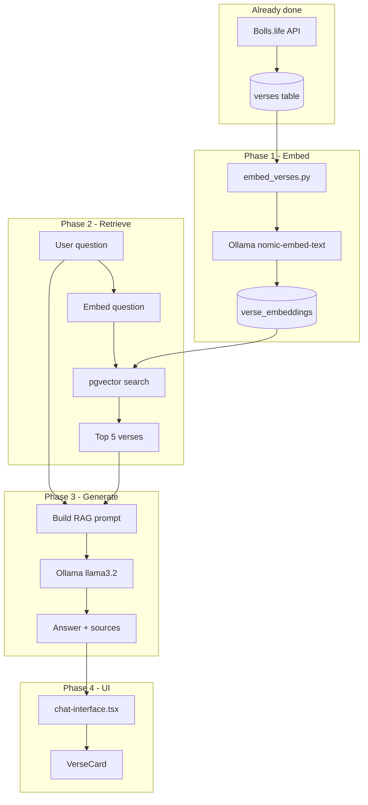

# DailyBreadAI — RAG Implementation Guide

This document explains **how we will add RAG** (Retrieval-Augmented Generation) to Daily Bread AI — what it is, where we are today, and the exact steps to build it.

---

## What is RAG?

**RAG** = **R**etrieval + **A**ugmented + **G**eneration

Instead of asking the LLM to answer from memory (which causes made-up verses), we:

1. **Retrieve** real Bible verses from our database that match the user's question
2. **Augment** the LLM prompt with those verses as context
3. **Generate** an answer grounded in that context

```
User: "What does the Bible say about peace?"
         │
         ▼
   [Embed question]          ← Ollama nomic-embed-text
         │
         ▼
   [Search pgvector]        ← Find closest verse vectors in Postgres
         │
         ▼
   Top 5 verses             ← John 14:27, Philippians 4:7, ...
         │
         ▼
   [Prompt LLM with verses + question]   ← Ollama llama3.2
         │
         ▼
   Answer + verse citations → Frontend VerseCard
```

The LLM only "sees" the verses we give it. That reduces hallucination and lets us show real citations.

---

## Where we are today

| Piece | Status | Notes |
|-------|--------|-------|
| Bible text in Postgres | ✅ Done | John (NIV) — 878 verses |
| `verse_embeddings` table | ✅ Schema ready | Empty — no vectors yet |
| Ollama chat | ✅ Done | `POST /chat` → friendly replies, no retrieval |
| Ollama embeddings | ❌ Not wired | Need `embed()` in `ollama.py` |
| `embed_verses.py` | ❌ Not created | Batch job to fill `verse_embeddings` |
| Retrieval service | ❌ Not created | pgvector similarity search |
| RAG service | ❌ Not created | Build prompt from retrieved verses |
| Frontend citations | ⏳ Partial | `VerseCard` exists; API doesn't return verses yet |

**Right now:** the chatbot talks like Daily Bread AI, but it does **not** search your ingested John verses yet.

**After RAG:** answers come from **your database**, with real verse references.

---

## Our stack (unchanged)

| Layer | Tool | Role |
|-------|------|------|
| Verse storage | PostgreSQL | `verses` table |
| Vector storage | pgvector | `verse_embeddings` table |
| Embeddings | Ollama `nomic-embed-text` | Text → 768-dim vector |
| Chat LLM | Ollama `llama3.2` | Answer from context |
| API | FastAPI | `/chat`, retrieval, RAG |
| UI | Next.js | Chat + `VerseCard` |

Everything runs locally in Docker. No OpenAI API key.

---

## The four phases

We build RAG in four phases. Complete each one before moving on.

### Phase 1 — Embed verses (offline job)

**Goal:** Every ingested verse gets a vector in `verse_embeddings`.

**Create:** `api/scripts/embed_verses.py`

**Flow:**

```
verses table (878 rows for John)
    │
    for each verse where no embedding exists:
        │
        ▼
    call Ollama POST /api/embeddings
        model: nomic-embed-text
        prompt: verse text (plain text, no HTML)
        │
        ▼
    INSERT INTO verse_embeddings (verse_id, model, embedding)
```

**Extend:** `api/app/services/ollama.py`

```python
async def embed(text: str) -> list[float]:
    # POST {OLLAMA_BASE_URL}/api/embeddings
    # return data["embedding"]  # 768 floats
```

**Script options (suggested):**

| Flag | Purpose |
|------|---------|
| `--translation NIV` | Only embed verses for this translation |
| `--book John` | Optional — limit to one book |
| `--batch-size 32` | How many verses per run (resume-friendly) |
| `--model nomic-embed-text` | Must match `OLLAMA_EMBED_MODEL` |

**Verify:**

```bash
docker exec dailybread-db psql -U postgres -d dailybread -c \
  "SELECT COUNT(*) FROM verse_embeddings;"
# Expect: 878 (after full John run)
```

**Optional index** (after data exists, speeds up search):

```sql
CREATE INDEX IF NOT EXISTS verse_embeddings_embedding_idx
ON verse_embeddings
USING ivfflat (embedding vector_cosine_ops)
WITH (lists = 100);
```

> Start without the index for 878 verses — brute-force search is fine. Add the index when you ingest the full Bible (~31k verses).

---

### Phase 2 — Retrieval (find relevant verses)

**Goal:** Given a user question, return the top-k most similar verses.

**Create:** `api/app/services/retrieval.py`

**Flow:**

```
user question: "What does the Bible say about peace?"
    │
    ▼
query_vector = await ollama.embed(question)
    │
    ▼
SQL (cosine distance via pgvector):
    SELECT v.id, v.text, b.name, v.chapter, v.verse,
           1 - (e.embedding <=> %s::vector) AS score
    FROM verse_embeddings e
    JOIN verses v ON v.id = e.verse_id
    JOIN books b ON b.book_num = v.book_num
    WHERE e.model = 'nomic-embed-text'
      AND v.translation_code = 'NIV'
    ORDER BY e.embedding <=> %s::vector
    LIMIT 5;
    │
    ▼
List of RetrievedVerse objects
```

**Design choices:**

| Choice | Recommendation | Why |
|--------|----------------|-----|
| Granularity | One embedding per **verse** | Easy citations (`John 14:27`) |
| `top_k` | **5** verses | Enough context, fits in LLM window |
| Distance | **Cosine** (`<=>`) | Standard for semantic search |
| Filter | By `translation_code` | NIV only for now |

**Test retrieval alone** (before RAG):

```bash
docker exec -it dailybread-api python -c "
import asyncio
from app.services.retrieval import search_verses
verses = asyncio.run(search_verses('What does the Bible say about peace?', limit=5))
for v in verses:
    print(v.reference, v.score, v.text[:80])
"
```

You should see John 14:27, Philippians 4:7, etc. (or other peace-related verses once the full Bible is ingested).

---

### Phase 3 — RAG service (answer with context)

**Goal:** Combine retrieval + LLM into one answer grounded in retrieved verses.

**Create:** `api/app/services/rag.py`

**Flow:**

```python
async def answer_question(question: str) -> RagResult:
    verses = await search_verses(question, limit=5)

    if not verses:
        return fallback_reply(question)  # no embeddings yet / empty DB

    context = format_verses_for_prompt(verses)

    prompt = f"""You are Daily Bread AI. Answer using ONLY the verses below.
If they do not fully answer the question, say what they do say and stay humble.
Keep your reply warm and short (2-4 sentences). Cite references inline.

Verses:
{context}

Question: {question}"""

    reply = await ollama.chat_with_context(prompt)
    return RagResult(reply=reply, sources=verses)
```

**Prompt rules (important):**

- Pass **full verse text** in the context block — not just references
- Tell the model: answer **only** from provided verses
- If nothing matches, say so honestly (don't invent verses)
- Keep Daily Bread AI tone from `ollama.py` system prompt

**Update:** `api/app/routers/chat.py`

```python
class ChatResponse(BaseModel):
    reply: str
    sources: list[VerseSource] = []  # text + reference for VerseCard

class VerseSource(BaseModel):
    text: str
    reference: str  # e.g. "John 14:27 (NIV)"
```

For greetings like "Hi, how are you?" you can **skip retrieval** and use the current friendly persona (no verses needed).

---

### Phase 4 — Frontend (show citations)

**Goal:** Display the LLM reply plus verse cards from the API.

**Update:** `client/app/(home)/_components/chat-interface.tsx`

```typescript
const { data } = await http.post<{
  reply: string;
  sources: { text: string; reference: string }[];
}>("/chat", { message: question });

setMessages((current) => [
  ...current,
  {
    id: crypto.randomUUID(),
    role: "assistant",
    content: data.reply,
    verses: data.sources,  // show one or more VerseCards
  },
]);
```

Show the **top source** as the main `VerseCard`, or map all `sources` to multiple cards.

---

## End-to-end diagram



---

## Files we will create or change

| File | Action | Purpose |
|------|--------|---------|
| `api/app/services/ollama.py` | **Extend** | Add `embed()` function |
| `api/scripts/embed_verses.py` | **Create** | Batch embed verses → pgvector |
| `api/app/services/retrieval.py` | **Create** | Similarity search |
| `api/app/services/rag.py` | **Create** | Retrieval + prompt + chat |
| `api/app/routers/chat.py` | **Update** | Return `reply` + `sources` |
| `client/.../chat-interface.tsx` | **Update** | Render `sources` as VerseCards |
| `api/app/db.py` (optional) | **Create** | Shared DB connection helper |

---

## Suggested build order

Do these in order. Test each step before the next.

```
1. embed() in ollama.py
      ↓ test: embed one verse text, print vector length (768)

2. embed_verses.py
      ↓ test: embed John only, COUNT(*) = 878

3. retrieval.py
      ↓ test: "peace" returns sensible John verses

4. rag.py
      ↓ test: POST /chat returns answer + sources

5. chat-interface.tsx
      ↓ test: UI shows reply + VerseCard

6. Ingest more books (optional)
      ↓ re-run embed_verses for new verses only
```

---

## Commands cheat sheet

```bash
# 1. Embed John (after script exists)
docker exec -it dailybread-api python /app/scripts/embed_verses.py \
  --translation NIV --book John

# 2. Check embedding count
docker exec dailybread-db psql -U postgres -d dailybread -c \
  "SELECT COUNT(*) FROM verse_embeddings;"

# 3. Test retrieval (after retrieval.py exists)
docker exec -it dailybread-api python -c "
import asyncio
from app.services.retrieval import search_verses
print(asyncio.run(search_verses('peace', limit=3)))
"

# 4. Test RAG chat
curl -s -X POST http://localhost:8000/chat \
  -H "Content-Type: application/json" \
  -d '{"message":"What does the Bible say about peace?"}' | jq
```

---

## Handling edge cases

| Case | Approach |
|------|----------|
| Greeting ("Hi!") | Skip RAG; use current friendly persona |
| No embeddings yet | Return helpful message: "Still indexing Scripture..." |
| Low similarity scores | If top score < threshold, say "I couldn't find a clear match" |
| User asks outside John | Works only for ingested books; ingest more or say scope is limited |
| Re-ingest / new verses | `embed_verses.py` skips verses that already have embeddings |

---

## What changes for the user experience

**Before RAG (now):**
- Friendly Ollama replies
- May cite verses from model memory (not always accurate)

**After RAG:**
- Same warm Daily Bread AI tone
- Answer grounded in **your** `verses` table
- Real `VerseCard` with text from the database
- Honest when Scripture in DB doesn't cover the topic

---

## Scope for v1

Keep the first RAG version small:

- **Translation:** NIV only
- **Corpus:** John (878 verses) — already ingested
- **Chunking:** One embedding per verse (no passage chunking yet)
- **top_k:** 5
- **No chat history** in v1 — each question is independent

Later upgrades: full Bible ingestion, conversation memory, passage-level chunking, score thresholds, streaming responses.

---

## Related docs

- [`SCRIPTS.md`](SCRIPTS.md) — Docker and ingestion commands
- [`SETUP.md`](SETUP.md) — Full dev environment setup
- [`docs/local-rag-learning-plan.md`](docs/local-rag-learning-plan.md) — Conceptual learning path
- [`docs/bible-data-ingestion-plan.md`](docs/bible-data-ingestion-plan.md) — How verses get into Postgres

---

## Next step

**Start with Phase 1:** add `embed()` to `ollama.py` and create `embed_verses.py` for John.

Once John has 878 rows in `verse_embeddings`, retrieval and RAG become straightforward SQL + prompt wiring.
